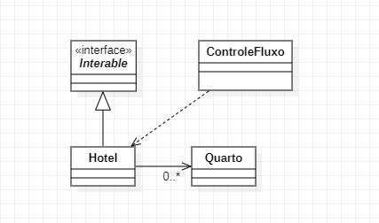

# Padrões de Projeto

## 3. Padrões comportamentais:

---

### 3.3 Interator

### 3.2.1 Introdução

Iterator é um padrão de design comportamental que permite percorrer elementos de uma coleção sem expor sua representação subjacente (lista, pilha, árvore, etc.).

### 3.2.2 Exemplo abordado
Para o exemplo busquei implementar um monitarador de quartos, podemos indeticar a quantidade de quartos vagos em hotel.

### 3.2.3 Diagrama de Classe do Exemplo

